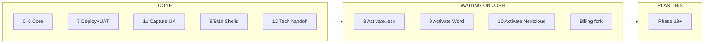
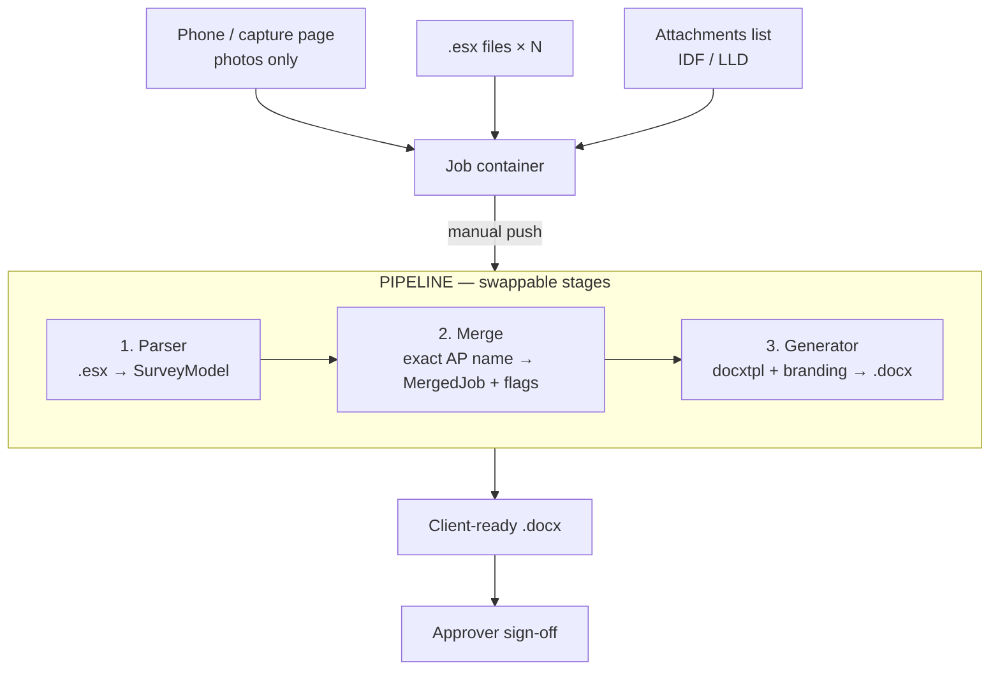
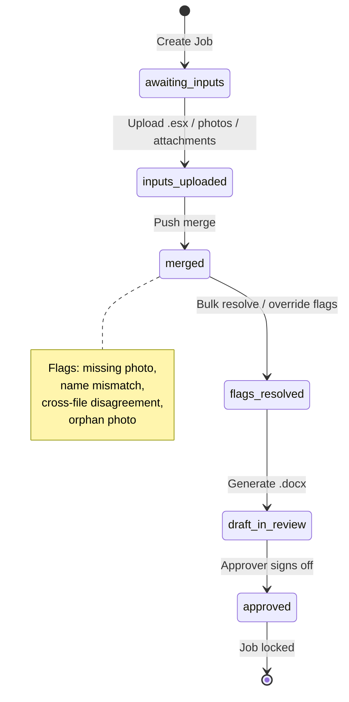
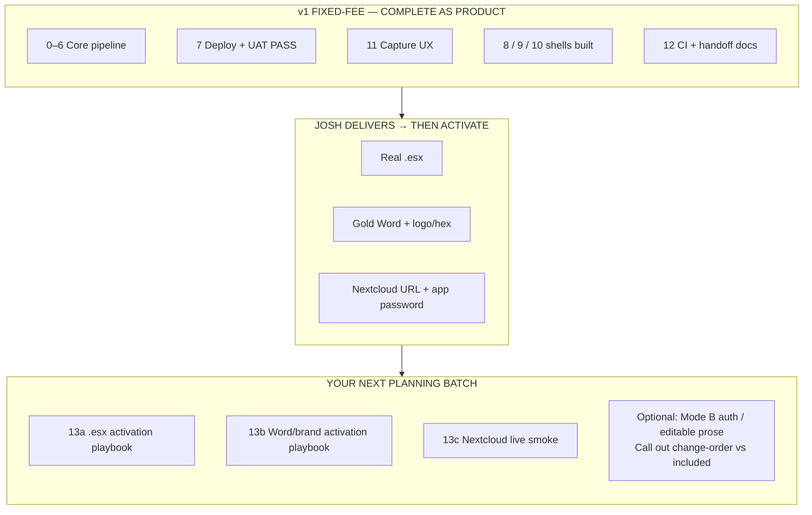
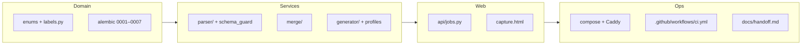
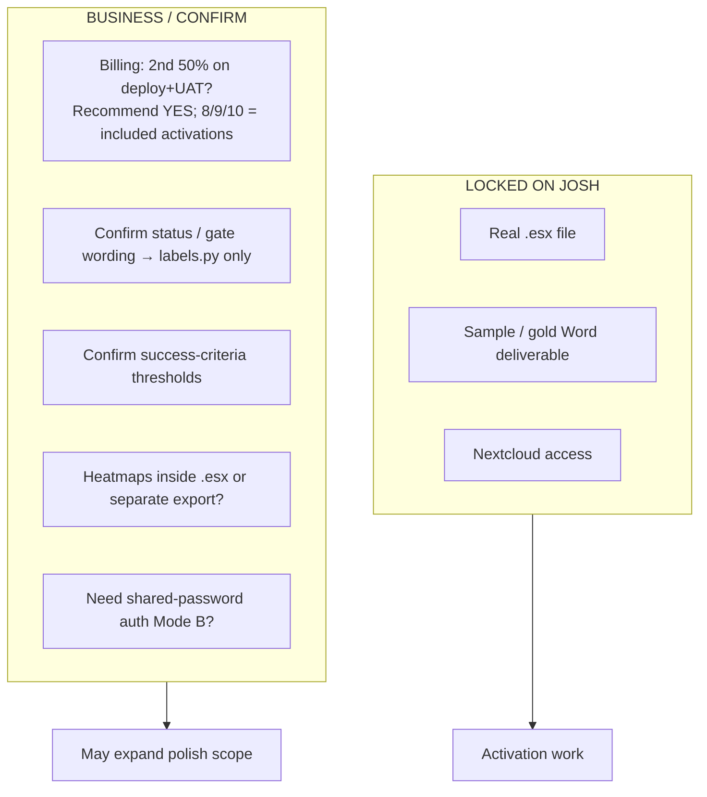
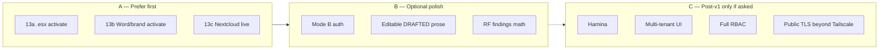

# J2 Survey Tool — status brief for next-phase planning

> **How to use:** Select all → paste into Claude.
> Mermaid diagrams render in Claude / Cursor preview like Plan mode.
> This is the authoritative “you are here” after fixed-fee v1.
> `docs/PHASES.md` only covers 0–6 — do not treat it as the full roadmap.

| | |
|---|---|
| **As of** | 2026-07-11 |
| **UAT** | 2026-07-08 **PASS** (sample fixtures) |
| **Deploy** | Tailscale `log-ai-01` + local prod compose |
| **Next phase #** | **13+** |

---

## Bottom line

- Fixed-fee **v1 is built and UAT-passed** on sample data.
- **Do not replan or rebuild** phases 0–12 shells.
- Next batch = **activation playbooks** and/or **post-v1 polish** — not greenfield pipeline.

---

## Architecture (what exists)

### Stage contracts

| Stage | In | Out |
|-------|----|-----|
| Parser | one `.esx` path | `SurveyModel` |
| Merge | surveys + photos + overrides | `MergedJob` + flags |
| Generator | MergedJob + template + branding | `.docx` in storage |

### Non-negotiables

1. Exact AP name join — hard-fail / flag; never guess  
2. Phone = capture-and-upload only  
3. Merge only on manual push  
4. Bulk override reasons + autocomplete  
5. Attachments are lists  
6. Branding in config (not engine)  
7. Multiple `.esx` per Job, parse per file  

**Stack:** Python 3.11 · FastAPI · Jinja2/HTMX · Postgres · docxtpl · Docker Compose · LocalStorage default · Nextcloud shell ready

---

## Job lifecycle (implemented + UAT’d)

Display labels live in `app/core/labels.py` (edit strings without migrations).

---

## Phase board

```mermaid
gantt
  title Phase progress (conceptual — not calendar dates)
  dateFormat X
  axisFormat %s

  section Batch 1 core
  0 Scaffold           :done, 0, 1
  1 Jobs + uploads     :done, 1, 2
  2 Parser             :done, 2, 3
  3 Merge + flags      :done, 3, 4
  4 Flag resolution UI :done, 4, 5
  5 Generator          :done, 5, 6
  6 Review + sign-off  :done, 6, 7

  section Batch 2
  7 Deploy + UAT       :done, 7, 8
  8 .esx SHELL         :done, 8, 9
  8 .esx ACTIVATE      :crit, 9, 10
  9 Template SHELL     :done, 10, 11
  9 Template ACTIVATE  :crit, 11, 12
  10 Nextcloud SHELL   :done, 12, 13
  10 Nextcloud ACTIVATE:crit, 13, 14
  11 Capture UX        :done, 14, 15
  12 Handoff tech      :done, 15, 16
  12 Billing agree     :crit, 16, 17

  section Next
  13+ Plan this batch  :active, 17, 19
```

### Status legend

| Symbol | Meaning |
|--------|---------|
| DONE | Built, tested, in repo |
| SHELL | Implementation ready; live use waits on Josh asset |
| ACTIVATE / crit | Blocked on Josh — not greenfield |
| OPEN | Business decision, not code |

### Batch 1 detail (0–6) — all DONE

| # | Goal | Status |
|---|------|--------|
| 0 | Scaffold / Docker / health | DONE |
| 1 | Job CRUD + uploads | DONE |
| 2 | Parser + fixtures | DONE (sample schema) |
| 3 | Merge + flags + manual push | DONE |
| 4 | Bulk flag resolution UI | DONE |
| 5 | Generator → downloadable docx | DONE (placeholder template) |
| 6 | Approve + readiness gates | DONE |

### Batch 2 detail (7–12)

| # | Goal | Shell | Activation |
|---|------|-------|------------|
| 7 | Deploy + UAT + `labels.py` | DONE (UAT PASS) | — |
| 8 | Real `.esx` alignment | DONE | Locked — needs J2 `.esx` |
| 9 | Template / branding polish | DONE | Locked — needs gold Word + brand |
| 10 | Nextcloud WebDAV | DONE | Locked — needs creds |
| 11 | Field capture UX | DONE | — |
| 12 | CI + backup + handoff docs | Tech DONE | Billing fork OPEN |

---

## Where you are (one picture)

---

## Evidence map (code that proves it)

| Area | Key paths |
|------|-----------|
| Status labels | `app/core/labels.py` |
| Storage | `app/core/storage.py` — Local + Nextcloud |
| Parser provisional header | still in `app/services/parser/parser.py` |
| Schema ASSUMED/CONFIRMED | `docs/esx_schema.md` |
| Template contract | `docs/template_map.md` + `tests/test_context_contract.py` |
| UAT evidence | `docs/uat_checklist.md` |

---

## Blockers & open decisions

### Parked (not v1 unless change-ordered)

- AI wall-attenuation inference  
- Hamina ingest  
- Multi-tenant relicensing UI  
- Full RBAC  
- Shared-password login gate (env contract only)

---

## What to plan next

| Bucket | Phases | Notes |
|--------|--------|-------|
| **A Activation** | 13a / 13b / 13c | Still fixed-fee intent; shells exist; one Josh asset each |
| **B Polish** | ask before scoping | Call out change-order vs included |
| **C Post-v1** | only if requested | Separate roadmap |

---

## Canon docs

| Doc | Role |
|-----|------|
| `CLAUDE.md` | Top-level agent context |
| `docs/ARCHITECTURE.md` | Pipeline contracts |
| `docs/DOMAIN.md` | Entities / roles / status |
| `docs/DECISIONS.md` | Confirmed + open |
| `docs/phase_07_*.md` … `phase_12_*.md` | Batch 2 specs |
| `docs/handoff.md` | Operator activation runbook |
| `docs/esx_schema.md` | Phase 8 diff surface |
| `docs/template_map.md` | Frozen docxtpl keys |
| `docs/uat_checklist.md` | Signed acceptance |

---

## Planner task (Claude: do this)

You are planning phases for **j2-survey-tool**.

**Product:** FastAPI + Jinja2/HTMX + Postgres. Pipeline `parser → merge → generator`. Exact AP name join; hard-fail flags; manual merge push; phone capture-only; branding in config.

**State (2026-07):** Fixed-fee v1 built + UAT PASS on sample fixtures (2026-07-08). Phases **0–6** and **7–12 shells** complete. Deployed behind Tailscale. CI = ruff + pytest. Handoff at `docs/handoff.md`.

**Do NOT replan/rebuild:** Job CRUD, parser/merge/generator shells, flag UI, generate/approve gates, capture UX, `labels.py`, LocalStorage, NextcloudStorage (mocked), placeholder template/context contract, deploy docs, UAT checklist.

**Blocked on Josh (activation only):**

1. Real J2 `.esx` → Phase 8 activate  
2. Gold Word + brand assets → Phase 9 activate  
3. Nextcloud URL + app password → Phase 10 activate  

**Open business:** bill 2nd 50% on deploy+UAT? (recommend yes; 8/9/10 activations included when assets arrive)

**Your deliverable:** Design the **next batch of bounded phases starting at 13+**. Prefer:

1. Activation playbooks for 8/9/10 (executable when assets arrive; no greenfield)  
2. Optionally 1–2 small polish phases — label change-order vs included  
3. Park Hamina / AI / multi-tenant / full RBAC unless asked for a separate post-v1 roadmap  

**Each phase must include:** goal · scope · done-when · depends-on · blockers (🔒 / 🟡 / ⚙️) · files likely touched · a small mermaid or status diagram if it clarifies sequencing.

Keep phases ADHD-friendly: one topic, one Cursor Ask→Plan→Build cycle. Canon wins: `CLAUDE.md`, `ARCHITECTURE`, `DOMAIN`, `DECISIONS`.
