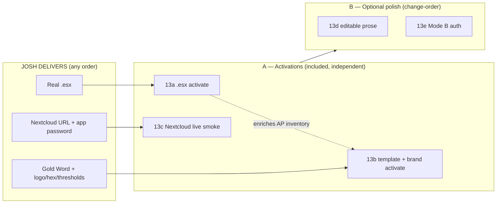

# Phase 13 batch — activation playbooks + optional polish  (index)

Continues Phase 12 / [`STATUS_FOR_NEXT_PHASES.md`](STATUS_FOR_NEXT_PHASES.md).
Canon: [`CLAUDE.md`](../CLAUDE.md) · [`ARCHITECTURE.md`](ARCHITECTURE.md) ·
[`DOMAIN.md`](DOMAIN.md) · [`DECISIONS.md`](DECISIONS.md) win.
Legend: 🔒 blocked on Josh · 🟡 sample config now · ⚙️ business decision.

**Not greenfield.** Phases 0–12 (core pipeline + 8/9/10 shells + capture UX +
handoff) are built and UAT-passed on sample fixtures (2026-07-08). This batch is
(A) **executable runbooks** that flip each Josh-blocked shell live, and (B) a
couple of **clearly-labeled optional polish phases**. Do not replan or rebuild the
shells.

## The batch

| Phase | Topic | Type | Gate |
|---|---|---|---|
| [**13a**](phase_13a_esx_activation.md) | Real `.esx` activation | Included activation | 🔒 real J2 `.esx` |
| [**13b**](phase_13b_template_brand_activation.md) | Template + brand activation | Included activation | 🔒 gold Word + logo/hex/thresholds |
| [**13c**](phase_13c_nextcloud_live.md) | Nextcloud live smoke | Included activation | 🔒 Nextcloud URL + app password |
| [**13d**](phase_13d_editable_prose.md) | Editable DRAFTED prose | ⚙️ Optional polish — **change-order** | none external |
| [**13e**](phase_13e_mode_b_auth.md) | Mode B shared-password gate | ⚙️ Optional polish — **change-order** | ⚙️ off-tailnet need |

**Included vs change-order:** 13a/b/c are the already-scoped activations that
complete when Josh delivers assets (see the billing fork in
[`phase_12_handoff_close.md`](phase_12_handoff_close.md) — recommend billing 2nd
50% on deploy+UAT and treating these as included). 13d/e are **post-v1 polish** —
only build on an explicit change-order.

## Sequencing

The three activations are **independent** — each unblocks on a single Josh asset
and can run in any order as assets land. 13b reads richer with 13a done (real AP
inventory in the doc), but does not depend on it. Each activation is one Cursor
Ask→Plan→Build cycle; do them one at a time.

## Parked (not this batch — separate post-v1 roadmap only if asked)

Per [`STATUS_FOR_NEXT_PHASES.md`](STATUS_FOR_NEXT_PHASES.md) bucket C and
[`DECISIONS.md`](DECISIONS.md) parked list:

- **RF findings math** — machine-authored pass/fail against success-criteria
  thresholds in the Findings section. Larger than a polish phase, depends on
  13b's confirmed thresholds. Change-order; scope separately if J2 wants
  auto-graded findings instead of DRAFTED prose.
- **Hamina ingest** · **AI wall-attenuation inference** · **Multi-tenant
  relicensing UI** · **Full RBAC** · **Public TLS beyond Tailscale** — post-v1
  roadmap items; do not fold into Phase 13.
