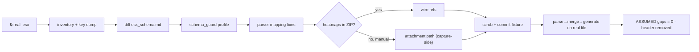

# Phase 13a — Real `.esx` activation playbook  🔒(real J2 `.esx`)  🟡(fixture_v1 schema now)

Continues Phase 12 / [`STATUS_FOR_NEXT_PHASES.md`](STATUS_FOR_NEXT_PHASES.md).
Canon: [`CLAUDE.md`](../CLAUDE.md) · [`DECISIONS.md`](DECISIONS.md) win.
Legend: 🔒 blocked on Josh · 🟡 sample config now · ⚙️ business decision.

**Executable runbook — no greenfield.** The Phase 8 shell is DONE (assumed schema
in [`esx_schema.md`](esx_schema.md), version guard, edge-case fixtures). This phase
*runs* that activation checklist against Josh's real export. Do it in one
Ask→Plan→Build cycle when the file lands.

## Goal
Flip the parser from `fixture_v1` (ASSUMED) to a CONFIRMED profile matched to J2's
real Ekahau export: correct field mappings, no ASSUMED gaps on the mainline path,
scrubbed real-shape fixtures committed, provisional header removed.

## Depends on
🔒 One real J2 `.esx` from Josh. Everything below is blocked until it arrives; the
shell it activates is already built.

## Blockers
- 🔒 Real `.esx` file (the whole phase).
- 🟡 Heatmap layout unverified — in-ZIP refs vs manual export unknown (Step 6).
- ⚙️ Whether a **second UAT sign-off** is required after real-file validation
  (business; [`handoff.md`](handoff.md) says re-run only if Josh wants it).

## Runbook (ordered — each step gates the next)

1. **Intake & safety.** Work on a copy in a scratch dir. **Never commit the raw
   client file** — it may carry client-identifying data. Confirm it opens as a ZIP.
2. **Inventory.** `unzip -l real.esx`; pretty-print each JSON file's top-level keys.
   Record the actual ZIP layout (nesting, image subfolders).
3. **Diff [`esx_schema.md`](esx_schema.md) field-by-field.** For every row, mark
   ASSUMED → CONFIRMED, correct the mapping, or add a new row. Capture deltas in a
   short diff table in the same doc.
4. **Update `schema_guard.py`.** Add a real profile (e.g. `j2_ekahau_2026`) with the
   real allowed-key whitelist. **Do not loosen guards without documenting new keys**
   in `esx_schema.md` — hard-fail philosophy stays (non-negotiable #1).
5. **Adjust `parser.py` mappings** *only where real keys differ* from the fixture.
   Keep AP-name preservation exact (no trim/case). No new stages, no rewrite.
6. **Heatmap decision gate 🟡.** Confirm whether heatmaps ride inside the `.esx`
   (per-floor/per-AP refs) or are a manual export. If manual → they become a Job
   attachment / capture-side upload, **not** a parser change (see the fallback in
   [`esx_schema.md`](esx_schema.md#heatmaps)). Record the answer; flip the ASSUMED
   heatmap rows.
7. **Commit scrubbed real-shape fixture(s).** Strip client names/addresses; add as a
   new fixture variant so the real shape is regression-covered. `fixture_v1`
   variants stay for backward compat.
8. **Flip provisional state.** Remove the "provisional/unverified" header comment in
   `parser.py`; ensure no ASSUMED field remains on the mainline path.
9. **Validate end to end.** Parse → merge → generate → download on the real file.
   Re-run the edge-case fixtures (must still pass) and CI (ruff + pytest).

## Done when
- Parser round-trips a real J2 `.esx`; no ASSUMED fields on the mainline path.
- `esx_schema.md` deltas recorded; real profile in `schema_guard.py`.
- Scrubbed real-shape fixture committed; edge-case fixtures still pass; CI green.
- Provisional header removed from `parser.py`.
- Heatmap source confirmed and documented.

## Files likely touched
- `app/services/parser/parser.py` · `app/services/parser/schema_guard.py`
- `docs/esx_schema.md` (diff table + ASSUMED→CONFIRMED flips)
- `tests/fixtures/build_sample_survey.py` + new scrubbed fixture(s)
- `tests/` parser unit tests
- Raw client `.esx` stays **uncommitted** (scratch only)

## Sequencing

