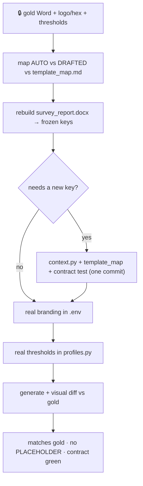

# Phase 13b — Template + brand activation playbook  🔒(gold Word + brand assets)  🟡(placeholder template now)

Continues Phase 12 / [`STATUS_FOR_NEXT_PHASES.md`](STATUS_FOR_NEXT_PHASES.md).
Canon: [`CLAUDE.md`](../CLAUDE.md) · [`DECISIONS.md`](DECISIONS.md) win.
Legend: 🔒 blocked on Josh · 🟡 sample config now · ⚙️ business decision.

**Executable runbook — no greenfield.** The Phase 9 shell is DONE (8-section
placeholder template, frozen context contract + contract test, sample branding,
sample success-criteria profiles). This phase *rebuilds the template to match
Josh's gold-standard report* and drops in real branding + thresholds, binding to
the **already-frozen** context keys.

## Goal
Produce a `templates_docx/survey_report.docx` whose rendered output visually
matches J2's real client deliverable, with real branding (logo/hex/company) and
real success-criteria thresholds — no PLACEHOLDER values on the mainline.

## Depends on
🔒 From Josh: (1) the gold-standard Word report, (2) brand logo + primary hex +
company name, (3) confirmed success-criteria thresholds per vertical. Independent
of Phase 13a; reads richer once 13a lands real AP data into the inventory section.

## Blockers
- 🔒 Gold Word sample; brand logo/hex; confirmed thresholds (the whole phase).
- 🟡 `BRAND_PRIMARY_COLOR="#1F4E79"` is placeholder navy until confirmed.
- ⚙️ AUTO vs DRAFTED split for Exec Summary / Findings — if J2 wants
  **machine-authored** findings (RF pass/fail math), that is **parked / change-order**
  (see [`phase_13_overview.md`](phase_13_overview.md)), not this phase.

## Runbook (ordered)

1. **Intake.** Receive gold Word + logo file + hex + company name + threshold table.
2. **Reverse-engineer the gold doc** against [`template_map.md`](template_map.md)'s
   eight sections (Cover, Exec Summary, Scope/Methodology, Success Criteria,
   Findings, AP Inventory, Issues & Gaps, Appendices). Mark each region **AUTO**
   (machine-fed) vs **DRAFTED** (human prose). Note headers, spacing, voice.
3. **Rebuild `templates_docx/survey_report.docx`** to match layout/voice, binding
   **only to the frozen `docxtpl` keys** in `template_map.md`. The contract test
   (`tests/test_context_contract.py`) guards against key removal.
4. **Missing-key gate.** If the gold doc needs a value the generator doesn't emit,
   that is the **only** allowed contract change: add the key in `context.py` **and**
   update `template_map.md` **and** the contract test *together* in the same commit.
   Do not silently diverge the template from the contract.
5. **Real branding.** Set `BRAND_COMPANY_NAME`, `BRAND_PRIMARY_COLOR` (real hex),
   `BRAND_LOGO_PATH` in `.env`; replace `branding/j2_logo_placeholder.png` with the
   real logo. Branding stays in config — **no client name in engine logic**
   (non-negotiable #6). Confirm the cover renders the real logo/hex.
6. **Real thresholds.** Replace the PLACEHOLDER values in
   `app/services/generator/profiles.py` with confirmed J2 numbers. Keep the
   lookup-table + per-job override design (`success_criteria_override` wins
   field-by-field). Drop the "PLACEHOLDER — confirm" caveats once confirmed.
7. **DRAFTED prose.** Match the placeholder Exec Summary / Scope / Findings voice to
   the gold doc's tone. If J2 wants Drafters to edit prose per-Job instead of a
   fixed template string, that is [Phase 13d](phase_13d_editable_prose.md)
   (change-order) — don't fold it in here.
8. **Visual diff.** Generate a Job (ideally with 13a's real `.esx`), open the
   download, and compare section-by-section to the gold doc. Iterate on the template
   only — never on the frozen keys.

## Done when
- Rendered `.docx` visually matches Josh's gold report section-by-section.
- Real logo/hex/company in `.env`; placeholder logo replaced.
- Real thresholds in `profiles.py`; no PLACEHOLDER thresholds on the mainline.
- Contract test green; `template_map.md` matches any added keys.
- CI green (ruff + pytest).

## Files likely touched
- `templates_docx/survey_report.docx` (rebuilt)
- `app/services/generator/context.py` (only if a new key is genuinely required)
- `app/services/generator/profiles.py` (real thresholds)
- `docs/template_map.md` · `tests/test_context_contract.py` (together, if keys change)
- `branding/` (real logo) · `.env` / `.env.example` (doc only)

## Sequencing

