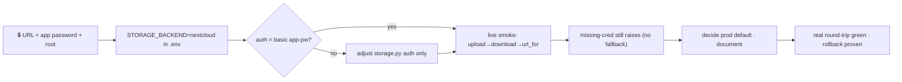

# Phase 13c — Nextcloud live smoke  🔒(WebDAV creds)  🟡(mocked WebDAV + local default now)

Continues Phase 12 / [`STATUS_FOR_NEXT_PHASES.md`](STATUS_FOR_NEXT_PHASES.md).
Canon: [`CLAUDE.md`](../CLAUDE.md) · [`DECISIONS.md`](DECISIONS.md) win.
Legend: 🔒 blocked on Josh · 🟡 sample config now · ⚙️ business decision.

**Smallest activation — mostly ops, minimal code.** The Phase 10 shell is DONE
(`NextcloudStorage` over WebDAV, mocked-WebDAV suite passing, `StorageNotConfiguredError`
on missing creds, no silent fallback). This phase points it at Josh's real
instance and runs one live round-trip. Least urgent — local stub already unblocks
everything upstream.

## Goal
Confirm a generated report round-trips through the real Nextcloud instance and
`url_for` yields a working link — without changing anything upstream of the
`Storage` interface, and without committing any secret.

## Depends on
🔒 From Josh: `NEXTCLOUD_URL`, `NEXTCLOUD_USERNAME`, `NEXTCLOUD_PASSWORD`
(app password), `NEXTCLOUD_WEBDAV_ROOT`. Independent of 13a/13b.

## Blockers
- 🔒 Real Nextcloud URL + app password (the live smoke).
- 🟡 Sample endpoint (`nextcloud.example.com`) until real values land.
- ⚙️ Does **prod default flip** to `nextcloud`, or stay `local` with Nextcloud as
  opt-in? (ops decision — see Step 6.)

## Runbook (ordered)

1. **Receive creds** from Josh over a secure channel. **Never commit real values** —
   they live in `.env` only; `.env.example` keeps placeholders.
2. **Set `.env`:** `STORAGE_BACKEND=nextcloud` + the four Nextcloud vars. Restart the
   `web` container.
3. **Confirm auth style.** `NextcloudStorage` assumes WebDAV app-password (basic).
   If Josh's instance differs, adjust the client's auth in `app/core/storage.py`
   only — the interface (`save`/`open`/`url_for`) stays fixed so nothing upstream
   changes.
4. **Confirm the WebDAV root** (`NEXTCLOUD_WEBDAV_ROOT`) exists or is auto-created,
   and the bot user has write permission there.
5. **Live smoke:** generate a report → confirm the file lands in Nextcloud (check the
   web UI / WebDAV listing) → download it back through the app → confirm `url_for`
   resolves to a working link.
6. **Default decision ⚙️.** Decide whether prod runs `STORAGE_BACKEND=nextcloud` by
   default or keeps `local` with Nextcloud opt-in. Record in
   [`deploy.md`](deploy.md) / [`handoff.md`](handoff.md).
7. **Regression:** with `STORAGE_BACKEND=nextcloud` and a cred unset, confirm the app
   still raises `StorageNotConfiguredError` loudly — **no silent fallback to local**
   (this is a production-misconfig guard, not a bug).
8. **Rollback proof:** set `STORAGE_BACKEND=local`, restart — the app reverts
   instantly. Document this as the escape hatch.

## Done when
- A generated report round-trips through the **real** Nextcloud instance;
  `url_for` yields a working link.
- Auth style confirmed; WebDAV root writable.
- Missing-cred path still raises cleanly (regression checked).
- No secret committed; local rollback verified.
- Prod default (nextcloud vs local) decided and documented.

## Files likely touched
- `.env` (real values — **not committed**)
- `app/core/storage.py` (**only** if the real instance's auth differs from basic app-password)
- `docs/deploy.md` · `docs/handoff.md` (default decision + smoke result)
- `.env.example` (doc only — placeholders stay)

## Sequencing

