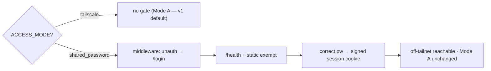

# Phase 13e — Mode B shared-password gate  ⚙️(change-order — only if off-tailnet needed)

Continues Phase 12 / [`STATUS_FOR_NEXT_PHASES.md`](STATUS_FOR_NEXT_PHASES.md).
Canon: [`CLAUDE.md`](../CLAUDE.md) · [`DECISIONS.md`](DECISIONS.md) · [`deploy.md`](deploy.md) win.
Legend: 🔒 blocked on Josh · 🟡 sample config now · ⚙️ business decision.

**Optional polish — build only if J2 needs off-tailnet access.** v1 ships
ACCESS_MODE **A** (Tailscale-only, no app auth), which matches the
no-post-handoff-cost constraint. The **env contract** for Mode B already exists
(`ACCESS_MODE=shared_password`, `SHARED_ACCESS_PASSWORD`; the app refuses to start
if the password is missing). The **login gate itself is deliberately not
implemented** in v1. This phase builds that gate.

## Included vs change-order ⚙️
**Recommend: change-order.** Mode B is explicitly parked in
[`deploy.md`](deploy.md) and [`STATUS_FOR_NEXT_PHASES.md`](STATUS_FOR_NEXT_PHASES.md)
("Shared-password login gate — env contract only"). Only build when J2 confirms
someone must reach the app **off the tailnet**. Full RBAC / multi-user stays parked
regardless — this is a single shared secret, not a user store.

## Goal
Implement a minimal single-shared-password session gate so that, under
`ACCESS_MODE=shared_password`, unauthenticated requests to app routes are redirected
to a login page; a correct password sets a signed session cookie. Tailscale Mode A
behavior is completely unchanged (no gate).

## Scope
- Login/logout routes (`app/api/auth.py`) + a minimal `login.html`.
- Middleware in `app/main.py`: when `ACCESS_MODE=shared_password`, redirect
  unauthenticated requests to `/login`; **exempt `/health`** (and static assets) so
  compose healthchecks and Tailscale/Caddy probes keep working.
- Correct password → signed session cookie (reuse `SECRET_KEY`); wrong password →
  re-prompt; logout clears the cookie.
- **Mode A untouched:** under `ACCESS_MODE=tailscale` the middleware is a no-op — no
  login, matching today's behavior. **No silent fallback between modes** (canon in
  [`deploy.md`](deploy.md)).
- Flip the "not implemented" caveats in [`deploy.md`](deploy.md) once built; keep
  Mode A as the documented v1 default.

## Non-negotiables honored
Roles remain workflow hats, not enforced permissions (this is an access gate, not
RBAC). No user accounts, no password store — one env secret. Engine/pipeline
untouched.

## Done when
- With `ACCESS_MODE=shared_password` + `SHARED_ACCESS_PASSWORD` set: unauthenticated
  app requests redirect to `/login`; correct password sets a session cookie and
  admits; wrong password is rejected; logout clears it.
- `/health` stays open in both modes.
- With `ACCESS_MODE=tailscale`: no gate, behavior identical to today.
- Tests cover both modes + the `/health` exemption; CI green.

## Depends on
Nothing external. ⚙️ Business confirmation that off-tailnet access is genuinely
needed — otherwise leave parked.

## Blockers
- ⚙️ Change-order + confirmation of off-tailnet need.
- 🟡 Password supplied via env only (no rotation UI, no per-user identity — by design).

## Files likely touched
- `app/main.py` (mode-gated middleware) · `app/api/auth.py` (new) ·
  `app/templates/login.html` (new)
- `app/core/config.py` (ACCESS_MODE / SHARED_ACCESS_PASSWORD handling)
- `docs/deploy.md` (flip Mode B "not implemented" → built)
- `tests/` (both modes + `/health` exemption)

## Sequencing

